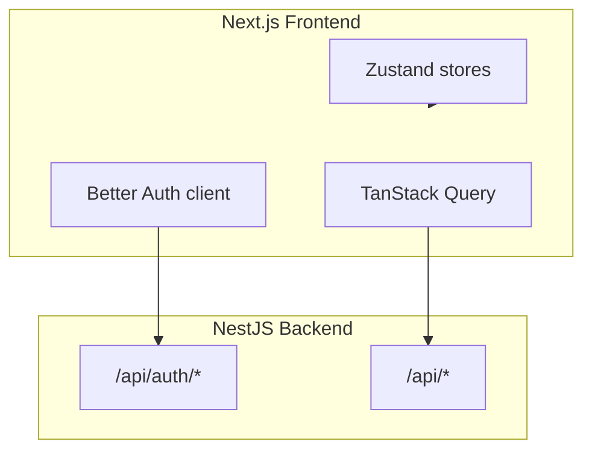

# Architecture

## Stack overview

This project is **frontend-only**. All auth, data, and business logic live in the NestJS backend. Next.js serves UI, client-side state, and static assets.

## State boundaries

| Layer           | Tool                         | Use for                              |
| --------------- | ---------------------------- | ------------------------------------ |
| Auth            | Better Auth client           | Sessions, sign-in/up, password reset |
| Server/API data | TanStack Query               | Fetched data, caching, mutations     |
| UI preferences  | Zustand (`useSettingsStore`) | Theme, font size, font family        |
| Loading UI      | Zustand (`useLoaderStore`)   | Global loading overlay               |

Do not store auth user in Zustand — use `authClient.useSession()`.

## Middleware flow

1. `next-intl` middleware runs first (locale prefix / redirect).
2. Locale **redirects** (307/308 without locale → with locale) return immediately.
3. **Auth** runs on the same request: admin paths and non-public routes require a session from `{NEXT_PUBLIC_API_URL}/api/auth/get-session`.
4. Unauthenticated users redirect to `/{locale}/auth/login`.

See [`src/middleware.ts`](../src/middleware.ts) and [`src/middlewares/auth.ts`](../src/middlewares/auth.ts).

## Server session

[`getServerSession()`](../src/lib/auth/server-session.ts) fetches the session in RSC (admin layout) using request cookies. This is defense in depth alongside edge middleware.

Admin routes use `export const dynamic = "force-dynamic"` because the shell depends on cookie-bound session data.

## Auth flow

1. User submits login form → `authClient.signIn.email()`
2. NestJS Better Auth sets HTTP-only session cookie via `{NEXT_PUBLIC_API_URL}/api/auth/*`
3. Middleware calls `{NEXT_PUBLIC_API_URL}/api/auth/get-session` (Edge-safe fetch to backend)
4. Protected pages require session; public routes include home and auth pages

### Session user shape (ABAC)

Map roles from Better Auth `session.user`:

- `user.role` (string), and/or
- `user.roles` (string array)

For local dev without Nest roles, set `NEXT_PUBLIC_DEV_ADMIN=true` to treat the user as `admin` in client ABAC only.

## API client

[`src/lib/api/client.ts`](../src/lib/api/client.ts) targets `NEXT_PUBLIC_API_URL` with `credentials: "include"`. Errors throw [`ApiError`](../src/lib/api/errors.ts) with status, message, and optional field errors.

### Mock mode

Set `NEXT_PUBLIC_USE_MOCK=true` (default) for in-memory data and mock auth. Set `NEXT_PUBLIC_USE_MOCK=false` to use NestJS REST + Better Auth and the Django vendor-core intake API. See [`src/lib/mock-mode.ts`](../src/lib/mock-mode.ts).

## Permissions (client ABAC)

[`src/permissions`](../src/permissions) evaluates policies client-side for **UI gating only** (hide nav, buttons). NestJS must enforce authorization on every API route.

Policies for admin components live in [`admin-components.json`](../src/permissions/abac/policies/admin-components.json). Each policy matches `resource.attributes.name` to a component id and `user.roles`.

| Component       | Action | Admin | Manager |
| --------------- | ------ | ----- | ------- |
| `groups-list`   | view   | yes   | yes     |
| `groups-create` | view   | yes   | no      |
| `groups-edit`   | view   | yes   | no      |
| `groups-delete` | delete | yes   | no      |
| `users-list`    | view   | yes   | yes     |
| `roles-list`    | view   | yes   | yes     |
| `settings-view` | view   | yes   | yes     |

Dev overrides: `NEXT_PUBLIC_DEV_ADMIN=true` (admin role), `NEXT_PUBLIC_DEV_MANAGER=true` (manager role, list-only).

## Caching strategy

| Area               | Strategy                                                 |
| ------------------ | -------------------------------------------------------- |
| Locale marketing   | Static where possible (`generateStaticParams`)           |
| Admin shell        | `force-dynamic` (session cookies)                        |
| Groups list/detail | Dexie live query + TanStack hydration (`staleTime: 60s`) |

## Package manager

This project uses **pnpm**. Run `pnpm install` — do not use yarn or npm lockfiles.

## Infrastructure

Local Docker under [`infra/`](../infra/README.md): host `pnpm build:docker` (Turbopack + standalone), then a runtime-only image via `pnpm docker:pack`.

## Production checklist

### Frontend (this repo)

- Set `NEXT_PUBLIC_API_URL` to your NestJS production domain
- Set `NEXT_PUBLIC_APP_URL` and `NEXT_PUBLIC_URL` to your Next.js frontend domain
- Set `NEXT_PUBLIC_USE_MOCK=false`
- Set `NEXT_PUBLIC_VENDOR_CORE_API_URL` when using intake / monitoring
- Set `NEXT_PUBLIC_SENTRY_DSN` and verify [`sentry.client.config.ts`](../sentry.client.config.ts) loads in production
- Optional analytics: `NEXT_PUBLIC_GA_ID`, `NEXT_PUBLIC_CLARITY_ID`
- Run `pnpm test-all` before deploy

### NestJS backend (external)

- Implement REST contracts in [`docs/api-contracts/`](./api-contracts/)
- CORS: allow frontend origin with `credentials: true` (see [`api-contracts/README.md`](./api-contracts/README.md))
- Better Auth trusted origins and cookie domain aligned with frontend URL
- Enforce authorization on every API route (client ABAC is UI-only)

### Backend cutover

1. Deploy NestJS with identity-groups (and users/roles/settings when ready).
2. Point `NEXT_PUBLIC_API_URL` at production API.
3. Remove mock env vars from `.env`.
4. Smoke-test admin: groups list → create → edit → delete. See [`identity-groups.md`](./api-contracts/identity-groups.md).
