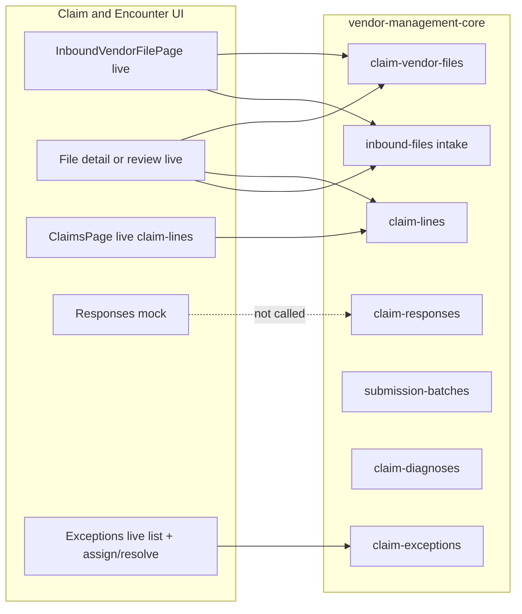

# Inbound Claims — frontend ↔ backend gap analysis

**Audience:** Frontend + backend (`vendor-management-core`) implementers  
**Date:** 2026-09-12  
**Frontend:** `vendor-management` — `src/features/admin/features/claim-encounter/` (Claim & Encounter)  
**Backend:** `vendor-management-core` — `/api/v1/` (`claims`, `intake`)  
**Policy:** Document what Claim & Encounter **Inbound / Claims** UI shows or expects that core already has but FE does not call — plus true remaining BE gaps (serializer enrichment, outbound package list, optional claim-line-level review).

**Related:** CMS EDGE gaps live separately at [`cms-edge/CMS_EDGE_FRONTEND_BACKEND_GAPS.md`](./cms-edge/CMS_EDGE_FRONTEND_BACKEND_GAPS.md) (exclude that surface here).  
**BE remaining gaps:** [`INBOUND_VENDOR_FILES_BACKEND_GAPS.md`](./INBOUND_VENDOR_FILES_BACKEND_GAPS.md)

**Entry points:**  
[`InboundVendorFilePage.tsx`](./pages/InboundVendorFilePage.tsx) · [`ClaimsPage.tsx`](./pages/ClaimsPage.tsx) · [`claimEncounterApi.ts`](./feature/api/claimEncounterApi.ts) · [`useClaimEncounterQuery.ts`](./feature/queries/useClaimEncounterQuery.ts)

---

## FE wired since original gap pass (2026-09-08 → 2026-09-12)

Inbound Vendor Files queue + file detail/review + exception writes:

| Endpoint / helper                                             | UI                                               |
| ------------------------------------------------------------- | ------------------------------------------------ |
| `GET /claim-vendor-files/list/` via `getInboundQueueSnapshot` | Inbound queue table, chips                       |
| `GET /claim-vendor-files/summary/`                            | Queue KPI strip                                  |
| `GET /claim-vendor-files/export/csv/`                         | Export CSV                                       |
| `GET /claim-vendor-files/{id}/`                               | File detail + review header                      |
| `POST /claim-vendor-files/{id}/accept\|reject/`               | Review Accept file / Reject (whole-file live)    |
| `GET /inbound-files/{id}/` enrich                             | Filename / stage on list mapper                  |
| `GET /inbound-files/{id}/download/`                           | EDI viewer body                                  |
| `POST /inbound-files/{id}/reprocess/`                         | Detail + review Reprocess                        |
| `GET /inbound-files/{id}/events/`                             | Detail + review Events panel                     |
| `GET /intake/completion/edi/` · `GET /monitoring/`            | Best-effort snapshot (non-blocking)              |
| `GET /claim-exceptions/list/`                                 | Open exception count + Exceptions page live list |
| `POST /claim-exceptions/{id}/assign\|resolve/`                | Exceptions assign / resolve                      |
| `GET /claim-lines/list/?vendor_file_id=`                      | File detail / review claims                      |
| Refresh                                                       | `invalidateQueries` (not fake timeout)           |

Still mock / unwired: Responses pages, Batches, Outbound packages, Claims workbench enrichment beyond claim-lines, per-claim-line live Accept/Reject.

### Core main update (2026-09-09) — FE wiring status

| Endpoint                                                                                | Relevance                     | FE status                                  |
| --------------------------------------------------------------------------------------- | ----------------------------- | ------------------------------------------ | ------------------------------------ | ------------------------------------ |
| `GET /inbound-files/{id}/download/`                                                     | File detail / review EDI body | **Wired** (live only; no fixture fallback) |
| `POST /submission-batches/{id}/generate-outbound/`                                      | Outbound 837P generate        | **New BE** — not called (outbound page)    |
| `GET /claim-headers/list                                                                | summary                       | /{id}/`                                    | Claim aggregate / EDGE               | **Wired** (resolve for void/replace) |
| `POST /claim-headers/{id}/void                                                          | replace/`                     | EDGE void/replace                          | **Wired** on CMS EDGE medical detail |
| `GET /remittance-files/…` (+ export) · `remittance-claims` · `remittance-service-lines` | 835 remittance                | **New BE** — Responses still mock          |
| Accept/Reject / summary / export on claim-vendor-files                                  | Review + queue                | **Wired** (file-level)                     |
| Exception assign / resolve                                                              | Exceptions workbench          | **Wired**                                  |

---

## How to read this document

| Column             | Meaning                                                                                                            |
| ------------------ | ------------------------------------------------------------------------------------------------------------------ |
| **FE expects**     | UI sections, KPIs, actions, or query params already rendered                                                       |
| **BE today**       | What exists in core (`urls` / serializers)                                                                         |
| **Gap**            | Missing wire, mock override, or missing product API                                                                |
| **Suggested work** | FE wire and/or BE contract                                                                                         |
| **Priority**       | **P0** wire existing reads · **P1** sibling pages + detail correctness · **P2** new product APIs / write workflows |

Labels:

- **FE client ready / page not calling** — `vendorCoreApi` + feature helpers exist; pages still use mock
- **Mock override** — remote fetch may run but result is discarded for sync mock helpers
- **No BE** — UI action has no matching core endpoint

---

## Architecture snapshot

**Verdict:** Inbound Vendor Files queue + file detail/review **reads and Accept/Reject writes** are live (file-level). Summary + CSV export + reprocess/events wired. Exceptions list + assign/resolve live. Responses / Batches / Outbound stay mock. Claims workbench claim-lines list + seed + soft-delete remain the other live island.

API prefix: `/api/v1/`.

---

## Route inventory (live vs mock)

| Route                                          | Page                    | Live today?                                                           |
| ---------------------------------------------- | ----------------------- | --------------------------------------------------------------------- |
| `/admin/claim-encounter/inbound`               | `InboundVendorFilePage` | **Yes** — queue + summary KPIs + CSV export                           |
| `/admin/claim-encounter/files/[fileId]`        | Claim file detail       | **Yes** — vendor file + claim-lines + EDI download + reprocess/events |
| `/admin/claim-encounter/files/[fileId]/review` | Accept / Reject review  | **Yes** — live Accept/Reject (whole file); mock still claim-level     |
| `/admin/claim-encounter/claims`                | Claims workbench        | **Partial** — `listClaimLines` + seed + delete                        |
| `/admin/claim-encounter/claims/[claimId]`      | Claim detail            | **Partial** — finds line from full list; no `getClaimLine`            |
| `/admin/claim-encounter/responses` (+ detail)  | Responses               | **No** — mock                                                         |
| `/admin/claim-encounter/exceptions` (+ detail) | Exceptions              | **Partial** — live list + assign/resolve; sparse diagnostic fields    |
| `/admin/claim-encounter/batches/[batchId]`     | Submission batch        | **No** — mock                                                         |
| `/admin/claim-encounter` / `outbound`          | Dashboard / Outbound    | **No** — mock                                                         |

Nav: Inbound Vendor Files + Claims under Claim & Encounter (`siteconfig`).

---

## 1. Inbound Vendor Files queue

**FE:** [`InboundVendorFilePage.tsx`](./pages/InboundVendorFilePage.tsx)  
**Data today:** `useInboundVendorQueueQuery` → `getInboundQueueSnapshot` (live when mock off). Mock fixtures when `isMockEnabled()`.

| Area               | FE expects                                                             | BE today                                                    | Gap                                                | Suggested work                             | Priority |
| ------------------ | ---------------------------------------------------------------------- | ----------------------------------------------------------- | -------------------------------------------------- | ------------------------------------------ | -------- |
| KPI strip          | Awaiting review, MFC rejected, SLA risk, avg wait, accepted/denied out | `GET /claim-vendor-files/summary/`                          | **Wired** (summary); outbound cards still `—` live | Outbound package list resource             | P2       |
| Status chips       | All / Pending / Rejected + age buckets                                 | List `status`, counts on DTO                                | **Wired**                                          | —                                          | —        |
| Filter bar         | Vendor, claim type, sort, search                                       | List has `batch`, `status`; vendor via batch/inbound enrich | Sparse vendor still possible                       | Enrich list serializer with vendor compact | P1       |
| Review queue table | File rows → Review / Open EDI                                          | `GET /claim-vendor-files/list/`                             | **Wired**                                          | —                                          | —        |
| Export CSV         | Download queue CSV                                                     | `GET /claim-vendor-files/export/csv/`                       | **Wired**                                          | —                                          | —        |
| Refresh            | Refetch                                                                | Invalidate query                                            | **Wired**                                          | —                                          | —        |
| Analytics          | Queue age pie, vendor backlog, needs attention                         | Summary + intake monitoring                                 | **Wired** (summary + best-effort monitoring)       | —                                          | —        |
| Bottom cards       | Workflow / vendor share / program snapshot                             | None dedicated                                              | Mostly FE copy                                     | Optional program rollup                    | P2       |

### Critical FE bug / pattern — **fixed**

[`getProgramFiles`](./feature/api/claimEncounterApi.ts) no longer discards remote list: live filters mapped vendor files; mock still uses `filesForProgram`.

`useInboundVendorQueueQuery` drives the inbound page.

---

## 2. Claim file detail

**FE:** Claim file detail page under `/files/[fileId]`  
**Data today:** `useClaimVendorFileDetailQuery` + `useClaimsForVendorFileQuery` (live).

| Area                 | FE expects                                      | BE today                                 | Gap                                                                                             | Suggested work                                                 | Priority |
| -------------------- | ----------------------------------------------- | ---------------------------------------- | ----------------------------------------------------------------------------------------------- | -------------------------------------------------------------- | -------- |
| File header / status | Filename, vendor, counts, review status         | `GET /claim-vendor-files/{id}/`          | **Wired**                                                                                       | Enrich vendor / review_status on serializer                    | P1       |
| Claims list for file | Lines belonging to file                         | `GET /claim-lines/list/?vendor_file_id=` | **Wired** (when claims panel shown)                                                             | —                                                              | —        |
| EDI viewer           | Live download only; error if missing/empty/fail | **`GET /inbound-files/{id}/download/`**  | **Wired** — mock mode still uses fixtures; see [`EDI_LIVE_DOWNLOAD.md`](./EDI_LIVE_DOWNLOAD.md) | Ensure seed sets `source_inbound_file_id` + downloadable bytes | done     |
| Reprocess / events   | Re-queue intake + show events                   | `POST …/reprocess/` · `GET …/events/`    | **Wired**                                                                                       | —                                                              | —        |
| Review CTA           | Navigate to review                              | N/A                                      | OK as nav                                                                                       | —                                                              | —        |

---

## 3. Claim file review (Accept / Reject)

**FE:** [`ClaimFileReviewPage`](./pages/ClaimFileReviewPage.tsx)  
**Data today:** Live file + claim-lines load. Live Accept/Reject call whole-file BE actions. Mock still uses claim-level `applyClaimReviews`.

| Area               | FE expects                       | BE today                                         | Gap                               | Suggested work                             | Priority |
| ------------------ | -------------------------------- | ------------------------------------------------ | --------------------------------- | ------------------------------------------ | -------- |
| Load file + claims | Same as detail                   | Vendor file + claim-lines by file                | **Wired**                         | —                                          | —        |
| Accept / Reject    | Persist review decision, reasons | `POST …/accept/` · `POST …/reject/` (file-level) | **Wired** live (whole file)       | Optional claim-line-level if product needs | P2       |
| Reject reasons     | Catalog UX                       | `reasons: string[]` + `notes` on reject          | **Wired** (codes sent as strings) | —                                          | —        |
| Reprocess / events | Same as detail                   | intake reprocess + events                        | **Wired**                         | —                                          | —        |

---

## 4. Claims workbench

**FE:** [`ClaimsPage.tsx`](./pages/ClaimsPage.tsx)  
**Live:** `useVendorCoreClaimLines` → `vendorCoreApi.listClaimLines()` (paged-all) when mock off. Seed + soft-delete wired.

| Area                          | FE expects                                                 | BE today                              | Gap                               | Suggested work                                                              | Priority |
| ----------------------------- | ---------------------------------------------------------- | ------------------------------------- | --------------------------------- | --------------------------------------------------------------------------- | -------- |
| Results table                 | Claim / line rows                                          | `GET /claim-lines/list/`              | **Wired**                         | Prefer server pagination params from UI (limit/offset) instead of fetch-all | P1       |
| Seed demo                     | Toolbar seed                                               | Claim-line seed (client)              | **Wired** (live)                  | Confirm core seed route still present on deployed main                      | P0       |
| Soft-delete                   | Row delete                                                 | `DELETE …/claim-lines/{id}/delete/`   | **Wired**                         | —                                                                           | —        |
| Restore / hard-delete         | Lifecycle                                                  | Restore + hard-delete APIs + FE hooks | **Hooks unused by page**          | Expose in UI if product needs                                               | P1       |
| Create / update               | Edit line                                                  | `POST create` / `PATCH update`        | Client exists; UI unused          | Wire editors if needed                                                      | P1       |
| Bulk accept / reject / assign | Toolbar actions                                            | No bulk review API; update exists     | Toast mock-only                   | Either map to `claim-lines/{id}/update/` status or new bulk action          | P2       |
| Excel export                  | Export                                                     | **No** claim-line CSV on core         | Toast “not available”             | Add export endpoint or client CSV from loaded page                          | P2       |
| Inline detail tabs            | Summary, Member, Services, Providers, Financial, Responses | Line DTO + client fake enrichment     | Diagnoses / member / NPI invented | `claim-diagnoses/list?claim_reference_id=`; member join if available        | P0       |
| History / Attachments / Notes | Tabs                                                       | **No** dedicated APIs                 | Placeholder copy                  | Document as out of scope or add resources                                   | P2       |
| EDI dialog                    | 837 fixture                                                | Local fixture                         | No API                            | Same as file EDI                                                            | P1       |

---

## 5. Claim detail page

**FE:** [`ClaimDetailPage.tsx`](./pages/ClaimDetailPage.tsx)

| Area                               | FE expects | BE today                                             | Gap                                                                       | Suggested work                                                | Priority |
| ---------------------------------- | ---------- | ---------------------------------------------------- | ------------------------------------------------------------------------- | ------------------------------------------------------------- | -------- |
| Load by claim id                   | Full claim | `GET /claim-lines/{id}/`                             | Loads **all lines** then `findClaimLineByClaimId`                         | Use `getClaimLine(id)` + sibling list by `claim_reference_id` | P0       |
| Service lines / financials         | Line table | Line DTO fields                                      | Sparse (NPIs/`line_kind` may be omitted on serializers — see EDGE gap §6) | Serialize model NPIs + line_kind                              | P0       |
| Diagnoses                          | Dx display | `GET /claim-diagnoses/list/`                         | Unused                                                                    | Prefetch by claim_reference_id                                | P0       |
| Contract & financials              | Rich panel | Limited amounts on line                              | Mostly mock                                                               | Clarify product vs intake fields                              | P1       |
| History / Documents / Notes        | Tabs       | None                                                 | Toast / empty                                                             | Out of scope until APIs exist                                 | P2       |
| PDF / reprocess / add note / print | Actions    | Reprocess only on **inbound-files**, not claim-lines | Toast-only                                                                | Wire reprocess via `source_inbound_file_id` if present        | P1       |

---

## 6. Sibling sections (same nav domain)

### Responses

| Area          | FE                                              | BE                         | Gap     | Priority                                            |
| ------------- | ----------------------------------------------- | -------------------------- | ------- | --------------------------------------------------- | --- |
| List / detail | Mock `responsesForProgram` / `getClaimResponse` | `GET /claim-responses/list | /{id}/` | Feature `listClaimResponses` exists; **pages mock** | P1  |

### Exceptions

| Area             | FE                                               | BE                                   | Gap       | Priority                        |
| ---------------- | ------------------------------------------------ | ------------------------------------ | --------- | ------------------------------- | --- |
| List / workbench | Live `useClaimExceptionsQuery` (+ mock fallback) | `GET /claim-exceptions/list          | /{id}/`   | Sparse diagnostic fields on DTO | P1  |
| Assign / resolve | Live assign (self) + resolve                     | `POST …/assign/` · `POST …/resolve/` | **Wired** | —                               |

### Submission batches

| Area         | FE   | BE                            | Gap     | Priority                   |
| ------------ | ---- | ----------------------------- | ------- | -------------------------- | --- |
| Batch detail | Mock | `GET /submission-batches/list | /{id}/` | Wrappers exist; pages mock | P1  |

### Dashboard / Outbound

| Area                 | FE   | BE                                                                                  | Gap                                         | Priority |
| -------------------- | ---- | ----------------------------------------------------------------------------------- | ------------------------------------------- | -------- |
| Dashboard KPIs       | Mock | Intake `monitoring` / EDI completion; claim aggregates                              | Unwired                                     | P1       |
| Dashboard / Outbound | Mock | `POST /submission-batches/{id}/generate-outbound/` exists; no outbound package list | Generate ready to wire; list KPIs still gap | P1/P2    |

---

## 7. FE client ready / page not calling

These are already (or partially) in [`src/lib/vendor-core/api.ts`](../../../lib/vendor-core/api.ts) and [`claimEncounterApi.ts`](./feature/api/claimEncounterApi.ts) — **do not rebuild**; fix callers / stop mock override:

| Symbol / path                                                                                 | Notes                                      |
| --------------------------------------------------------------------------------------------- | ------------------------------------------ |
| `listClaimVendorFiles` / `useClaimVendorFilesQuery`                                           | Remote mapper exists; Inbound page unused  |
| `getClaimVendorFile`                                                                          | Unused by file detail                      |
| `getProgramFiles`                                                                             | Fetches remote then **returns mock** — fix |
| `listClaimResponses` / `listClaimExceptions` / `listSubmissionBatches` / `listClaimDiagnoses` | Feature wrappers; sibling pages mock       |
| `listClaimLines` / `seedClaimLines` / `deleteClaimLine`                                       | **Used** by Claims                         |
| `getClaimLine` / `createClaimLine` / `updateClaimLine` / restore / hard-delete                | Client or hooks exist; pages underuse      |
| `listInboundFiles` / `getInboundFile` / `reprocessInboundFile`                                | Intake; unused by Inbound Claims UI        |
| EDI completion / monitoring                                                                   | Unused for KPIs                            |

---

## 8. Core inventory (claims + intake relevant)

### Claims app — claim lines (only full CRUD)

| Method                      | Path                             | Used by Inbound Claims UI?   |
| --------------------------- | -------------------------------- | ---------------------------- |
| GET                         | `/claim-lines/list/`             | **Yes** (Claims)             |
| GET                         | `/claim-lines/{id}/`             | **No** (should be)           |
| POST                        | `/claim-lines/create/`           | No                           |
| PATCH                       | `/claim-lines/{id}/update/`      | No                           |
| DELETE                      | `/claim-lines/{id}/delete/`      | **Yes** (Claims soft-delete) |
| POST                        | `/claim-lines/{id}/restore/`     | No                           |
| DELETE                      | `/claim-lines/{id}/hard-delete/` | No                           |
| Seed (if mounted on deploy) | claim-lines seed                 | **Yes** (Claims toolbar)     |

### Claims app — read-only neighbors + review writes

| Method | Path                              | Used by Inbound Claims UI? |
| ------ | --------------------------------- | -------------------------- | ---------------- |
| GET    | `/claim-vendor-files/list         | /{id}/`                    | **Yes**          |
| GET    | `/claim-vendor-files/summary/`    | **Yes**                    |
| GET    | `/claim-vendor-files/export/csv/` | **Yes**                    |
| POST   | `/claim-vendor-files/{id}/accept  | reject/`                   | **Yes** (review) |
| GET    | `/claim-responses/list            | /{id}/`                    | **No**           |
| GET    | `/claim-exceptions/list           | /{id}/`                    | **Yes**          |
| POST   | `/claim-exceptions/{id}/assign    | resolve/`                  | **Yes**          |
| GET    | `/submission-batches/list         | /{id}/`                    | **No**           |
| GET    | `/claim-diagnoses/list            | /{id}/`                    | **No**           |

### Intake — inbound pipeline

| Method | Path                             | Used by Inbound Claims UI? |
| ------ | -------------------------------- | -------------------------- |
| GET    | `/inbound-files/` + `/{id}/`     | **Yes** (enrich)           |
| GET    | `/inbound-files/{id}/download/`  | **Yes**                    |
| GET    | `/inbound-files/{id}/events/`    | **Yes**                    |
| POST   | `/inbound-files/{id}/reprocess/` | **Yes**                    |
| GET    | `/intake/completion/edi/`        | **Yes** (best-effort)      |
| GET    | `/monitoring/`                   | **Yes** (best-effort)      |

`claims_bridge` = pipeline-only service (no public HTTP).

### Explicitly missing / remaining on BE

- Optional **claim-line-level** Accept / Reject (live is file-level only)
- Outbound package **list** KPIs (generate-outbound exists)
- Serializer enrichment (vendor name, filename, review_status)
- History / attachments / notes resources for claims
- Dedicated `stats/` / `facets/` — prefer existing **`summary/`** instead

---

## 9. Priority backlog

### P0 — Wire existing reads (no new BE)

1. Fix `getProgramFiles` (and siblings) to use remote-mapped files, not `filesForProgram` after fetch.
2. Point Inbound queue at `useClaimVendorFilesQuery` / `listClaimVendorFiles`.
3. File detail: `getClaimVendorFile` + `listClaimLines` filtered by `vendor_file_id`.
4. Claim detail: `getClaimLine` + diagnoses by `claim_reference_id`.
5. Confirm deployed core still exposes claim-line seed if FE Seed button depends on it.

### P1 — Sibling pages + intake enrichment

1. Live Responses / Batches from existing GETs (Exceptions list already live).
2. Claim-line list pagination from UI; restore/hard-delete if product needs.
3. Serialize claim-line NPI / `line_kind` if still omitted (shared with EDGE gap).
4. Enrich vendor-file serializers (vendor name, filename, review_status).

### P2 — New product APIs

1. Optional claim-line-level accept/reject (if product needs beyond file-level).
2. Outbound package list KPIs (generate-outbound already exists).
3. History / documents / notes if product requires.

---

## 10. Section checklist (sign-off)

- [x] Inbound queue KPIs + table from `claim-vendor-files` (summary + list)
- [x] File detail + review load live file + claim-lines
- [x] Review Accept/Reject wired live (file-level)
- [ ] Claims list paginated; detail via `getClaimLine`
- [ ] Diagnoses from `claim-diagnoses`
- [x] Exceptions list + assign/resolve live (Responses / Batches still mock)
- [x] Refresh/reprocess uses intake inbound-files where applicable
- [ ] No “fetch remote then return mock” helpers left in claimEncounterApi

---

## 11. Key file references

| Layer          | Path                                                          |
| -------------- | ------------------------------------------------------------- |
| Inbound page   | `…/claim-encounter/pages/InboundVendorFilePage.tsx`           |
| Claims page    | `…/claim-encounter/pages/ClaimsPage.tsx`                      |
| Claim detail   | `…/claim-encounter/pages/ClaimDetailPage.tsx`                 |
| Feature API    | `…/claim-encounter/feature/api/claimEncounterApi.ts`          |
| Queries        | `…/claim-encounter/feature/queries/useClaimEncounterQuery.ts` |
| Mock           | `…/claim-encounter/mock-data.ts`                              |
| Vendor client  | `vendor-management/src/lib/vendor-core/api.ts`                |
| BE claims urls | `vendor-management-core/core/claims/urls.py`                  |
| BE intake      | `vendor-management-core/core/intake/`                         |

---

**Bottom line:** Inbound Vendor Files review writes (Accept/Reject), summary/export, reprocess/events, and exception assign/resolve are **FE-wired** against existing core APIs. Remaining gaps are serializer enrichment, Responses/Batches/Outbound pages, Claims detail correctness, and optional claim-line-level review — not missing Accept/Reject endpoints.
