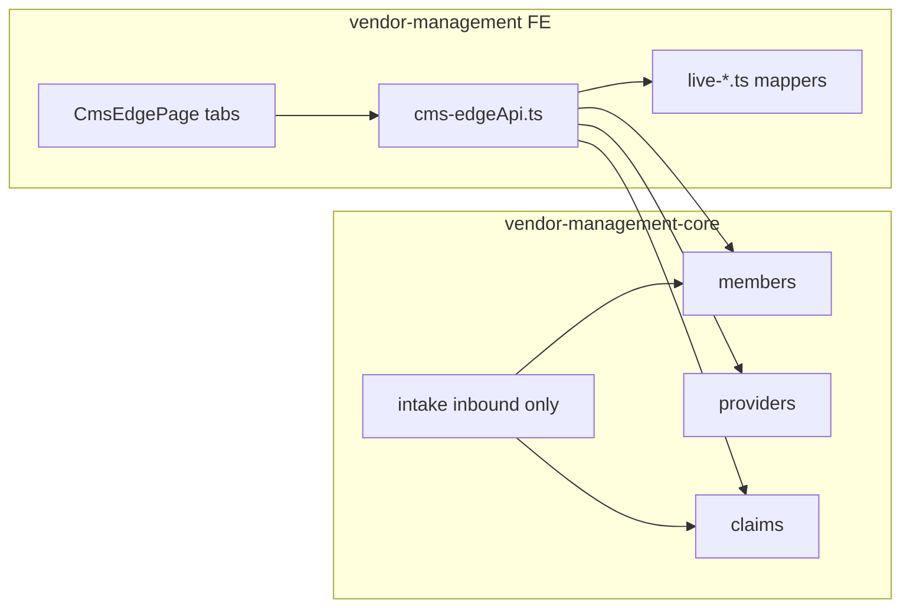

# CMS EDGE — frontend ↔ backend gap analysis

**Audience:** Backend (`vendor-management-core`) implementers  
**Date:** 2026-09-08  
**Frontend:** `vendor-management` — `src/features/admin/features/claim-encounter/cms-edge/`  
**Backend:** `vendor-management-core` — `/api/v1/` domain apps (`members`, `providers`, `claims`, `intake`)  
**Policy:** Document what the **frontend already shows or expects** that the **backend is missing or incomplete**, so BE can implement contracts that fit FE section-by-section.

**Related FE entry:** [`CmsEdgePage.tsx`](./CmsEdgePage.tsx) · API layer [`feature/api/cms-edgeApi.ts`](./feature/api/cms-edgeApi.ts) · mappers `live-*.ts`

---

## FE wired since original gap pass (2026-09-08)

Main `CmsEdgePage` now calls these previously unused core routes (not Reporting shell):

| Endpoint                                                        | EDGE UI                                           |
| --------------------------------------------------------------- | ------------------------------------------------- | --------- | ----------- | --------------------- | ------------------------------------ |
| `GET /members/stats/`                                           | Members list KPIs + Overview entity card          |
| `GET /members/facets/`                                          | Members plan filter options                       |
| `GET /members/list/export/csv/`                                 | Members list Export                               |
| `GET /members/{id}/export/csv/`                                 | Member detail Export                              |
| `GET /members/{id}/family-links/list/`                          | Member family                                     |
| `GET /members/{id}/source-records/list/`                        | View Source Record                                |
| `GET /members/{id}/claims/list/`                                | Member identification / validation note           |
| `GET /members/{id}/accumulators/summary/`                       | Validation alert note                             |
| `GET /members/{id}/change-events/list/` (+ eligibility history) | Change / Eligibility History tab                  |
| `GET /providers/stats/`                                         | Providers list KPIs + Overview entity card        |
| `GET /providers/facets/`                                        | Specialty search hint                             |
| `GET /providers/list/export/csv/`                               | Providers list Export                             |
| `GET /providers/{id}/claims/recent/list/`                       | Associated claims                                 |
| `GET /providers/{id}/exceptions/list/`                          | Error history                                     |
| `GET /providers/{id}/identifiers                                | networks                                          | locations | credentials | vendor-sources/list/` | Identification + submission stand-in |
| `GET /claim-exceptions/list/`                                   | Overview exceptions panel (aggregated)            |
| `GET /claim-vendor-files/list/` + `GET …/{id}/`                 | Overview activity + medical claim source          |
| `GET /eligibility-files/list/`                                  | Overview activity                                 |
| `GET /pharmacy-claim-files/list/`                               | Overview activity + pharmacy list filename enrich |

Still **not** wired / still missing product APIs: Reconciliation / Financial reporting tabs (no matching `/cms-edge/*` list); some EDGE semantic field polish on members/providers/claims. Overview `/cms-edge/overview/*`, settings, file-packages, and reporting list tabs are **wired**.

---

## Core main update (2026-09-09) — `/api/v1/cms-edge/*` (now wired on FE)

`vendor-management-core` `main` @ `590700a` mounts `core.cms_edge.urls` under `/api/v1/`. FE client + Overview / File Gen / Configuration / Reporting lists now call:

| Method   | Path                                   | Purpose              | FE                              |
| -------- | -------------------------------------- | -------------------- | ------------------------------- | --------------------------- | --------------- |
| GET      | `/cms-edge/settings/`                  | EDGE settings detail | Configuration + Overview config |
| POST     | `/cms-edge/settings/update/`           | Update settings      | Configuration Save              |
| GET      | `/cms-edge/reporting-periods/list/`    | Reporting periods    | Configuration table             |
| GET      | `/cms-edge/overview/stats/`            | Overview KPI strip   | Overview                        |
| GET      | `/cms-edge/overview/workflow/`         | Overview workflow    | Overview                        |
| GET      | `/cms-edge/overview/activity/list/`    | Activity feed        | Overview                        |
| GET      | `/cms-edge/overview/exceptions/list/`  | Overview exceptions  | Overview                        |
| GET/POST | `/cms-edge/file-packages/list          | create/`             | File Gen packages               | File Generation             |
| GET      | `/cms-edge/file-packages/{id}/`        | Package detail       | (client)                        |
| POST     | `/cms-edge/file-packages/{id}/generate | package              | submit/`                        | Generate / package / submit | File Generation |
| GET      | `/cms-edge/submissions/list/`          | Submission history   | Reporting Submissions           |
| GET      | `/cms-edge/cms-responses/list/`        | CMS responses        | Reporting Responses             |
| GET      | `/cms-edge/validation-runs/list/`      | Validation runs      | Reporting Validations           |
| GET      | `/cms-edge/audit-requests/list/`       | Audit requests       | Reporting Audit                 |
| GET      | `/cms-edge/documents/list/`            | Document library     | Reporting Documents             |

**Also wired:** `POST /pharmacy-claim-rows/{id}/void/`, `POST /claim-headers/{id}/void|replace/` (medical detail).

**Also new (members, helps EDGE pharmacy):** `POST /pharmacy-claim-rows/seed/`, `POST /eligibility-files/create/`, `POST /member-coverages/create|seed/`.

---

## How to read this document

Each section uses:

| Column                | Meaning                                                                                                                                  |
| --------------------- | ---------------------------------------------------------------------------------------------------------------------------------------- |
| **FE expects**        | UI fields, KPIs, actions, or query params the EDGE UI already renders or calls                                                           |
| **BE today**          | What exists in core (`urls` / serializers / models)                                                                                      |
| **Gap**               | Missing or incomplete for FE↔BE fit                                                                                                      |
| **Suggested BE work** | Concrete endpoint/field work                                                                                                             |
| **Priority**          | **P0** expose existing model fields / fix 404s · **P1** EDGE domain fields & list KPIs · **P2** outbound submission / config / reporting |

Also labeled:

- **BE ready / FE not calling** — do not rebuild; FE can wire later
- **FE-derived** — FE invents EDGE labels (`CMS Ready`, etc.) from generic status; BE should eventually own these

---

## Architecture snapshot

Today: FE dresses generic VMS read models as “CMS EDGE.” There is **no** `edge` / HIOS / SDR / outbound EDGE file-generation app in core.

API prefix: `/api/v1/`.

---

## 1. Overview tab

**FE:** [`CmsEdgeOverviewTab.tsx`](./CmsEdgeOverviewTab.tsx) · `getOverviewEntitySnapshot()`

| Area                    | FE expects                                                                                                       | BE today                                                            | Gap                                                                     | Suggested BE work                                     | Priority |
| ----------------------- | ---------------------------------------------------------------------------------------------------------------- | ------------------------------------------------------------------- | ----------------------------------------------------------------------- | ----------------------------------------------------- | -------- |
| KPI strip (7 cards)     | Reporting period, data readiness %, files required/generated, submission status, critical errors, reconciliation | **`GET /cms-edge/overview/stats/`**                                 | **Wired** via `getOverviewShell`                                        | —                                                     | done     |
| Entity cards            | Members / Providers / Claims totals + ready + errors                                                             | `members/stats/`, `providers/stats/` + claim list totals            | **Wired** — member/provider from stats; claim errors still page-derived | Claim-level aggregate stats still useful              | P1       |
| Submission workflow     | 6-stage pipeline (source → validation → generation → submit → response → reconcile)                              | None                                                                | Empty live                                                              | Workflow status API tied to EDGE submission lifecycle | P2       |
| Exceptions panel        | Exception type, count, severity, owner                                                                           | `claim-exceptions/list/` aggregated by FE                           | **Wired** (EDI exception shape, not EDGE-native)                        | Dedicated EDGE exception taxonomy optional            | P2       |
| Latest activity         | Activity rows (file, env, status, owner)                                                                         | `claim-vendor-files` + `eligibility-files` + `pharmacy-claim-files` | **Wired** as intake file activity                                       | True EDGE ops activity feed still P2                  | P2       |
| CMS configuration strip | HIOS issuer ID, state, reporting period, file types                                                              | None                                                                | Empty live                                                              | See **Configuration** (§10)                           | P2       |

**Note:** Overview “View all exceptions” navigates nowhere on main EDGE page (no exceptions tab). Reporting shell is a separate mock surface (§11).

---

## 2. Members & Enrollment — list

**FE:** [`CmsEdgeMembersEnrollmentTab.tsx`](./CmsEdgeMembersEnrollmentTab.tsx) · `listEdgeMembers` → `GET /api/v1/members/list/`

| Area               | FE expects                                                                                                | BE today                                                                  | Gap                                                                      | Suggested BE work                                                                                      | Priority |
| ------------------ | --------------------------------------------------------------------------------------------------------- | ------------------------------------------------------------------------- | ------------------------------------------------------------------------ | ------------------------------------------------------------------------------------------------------ | -------- |
| Table columns      | Enrollee ID, subscriber ID, relationship, DOB, sex, location, plan, coverage period, paid YTD, CMS status | List DTO has demographics, plan_name, dates, paid_ytd, status/eligibility | No `hios_issuer_id`; no EDGE `cms_status`                                | Add `hios_issuer_id` (or issuer FK) + optional `cms_edge_status` / validation summary on list or stats | P1       |
| KPIs               | Total, CMS Ready, Validation Errors, Coverage Mismatches, Unmapped Plan IDs                               | `GET /api/v1/members/stats/`                                              | **Wired** — FE maps stats → Active/Pending/Termed/Inactive labels        | Extend stats with true EDGE CMS Ready buckets                                                          | P1       |
| Filters            | Status, coverage type, plan, relationship, error type                                                     | List filters + `members/facets/`                                          | **Facets wired** for plan names; other filters still client-side on page | Server-side filters + pagination-aware counts                                                          | P1       |
| Reporting period   | Header select                                                                                             | Cosmetic FE state                                                         | Not sent to API                                                          | Accept `reporting_period` / date range on list + stats                                                 | P1       |
| Export             | Export button                                                                                             | `members/list/export/csv/`                                                | **Wired**                                                                | EDGE-specific extract optional                                                                         | P2       |
| Data quality strip | Missing subscriber, missing dates, unmapped plan, needs review                                            | None                                                                      | FE-derived from page                                                     | Optional quality facets endpoint                                                                       | P2       |

---

## 3. Member detail

**FE:** [`CmsEdgeMemberDetail.tsx`](./CmsEdgeMemberDetail.tsx) · `getEdgeMember` →  
`GET /members/{id}/` + `plan-history/` + `eligibility-history/` + `exceptions/` + `family-links/` + `source-records/` + `claims/` + `change-events/` + `accumulators/summary/`  
**Write:** Create Correction → `POST /members/{id}/exceptions/create/`  
**Export:** `GET /members/{id}/export/csv/`

| Area                     | FE expects                                                                                        | BE today                                                      | Gap                                                                     | Suggested BE work                                                          | Priority |
| ------------------------ | ------------------------------------------------------------------------------------------------- | ------------------------------------------------------------- | ----------------------------------------------------------------------- | -------------------------------------------------------------------------- | -------- |
| Identification           | Enrollee / subscriber IDs, demographics, race/ethnicity, source vendor                            | Detail 360 + nested demographics                              | Sparse fields often blank; no HIOS on detail                            | Ensure issuer/HIOS + stable Unique Enrollee ID on detail                   | P1       |
| Enrollment periods       | Plan ID, coverage start/end, monthly premium, EHB, Federal APTC, state subsidy, ICHRA, CMS status | Plan history: plan_name/type/id, dates, change_reason         | Premium / APTC / EHB / subsidy / ICHRA usually absent                   | Add EDGE enrollment financial fields on plan history or coverage component | P1       |
| Family                   | Linked members                                                                                    | `family-links/list/` preferred over embed                     | **Wired**                                                               | —                                                                          | —        |
| Corrections / exceptions | Type, description, status, source, reviewed by                                                    | Exception CRUD exists                                         | `reviewed_by` / resolution UX weak; no EDGE-specific exception taxonomy | Standardize exception_type enum for EDGE; include reviewer + timestamps    | P1       |
| Current validation KPIs  | Passed / warnings / errors                                                                        | FE counts from exceptions + accumulator note                  | No authoritative validation run                                         | Optional validation-summary on member detail                               | P2       |
| Submission history       | Submission type, period, date, status, file                                                       | Change-events + eligibility-history mapped into history table | **Wired** as change/eligibility stand-in (not EDGE file submissions)    | True EDGE submission history still P2                                      | P2       |
| View source record       | Deep link to enrollment feed / source                                                             | `source-records/list/`                                        | **Wired** (toast with filename/id)                                      | Deep link route optional                                                   | P1       |
| Export member            | Export                                                                                            | `members/{id}/export/csv/`                                    | **Wired**                                                               | —                                                                          | —        |

---

## 4. Providers — list

**FE:** [`CmsEdgeProvidersTab.tsx`](./CmsEdgeProvidersTab.tsx) · `listEdgeProviders` → `GET /api/v1/providers/list/`

| Area                   | FE expects                                                                                           | BE today                                                        | Gap                                                                                  | Suggested BE work                                                                                                                       | Priority |
| ---------------------- | ---------------------------------------------------------------------------------------------------- | --------------------------------------------------------------- | ------------------------------------------------------------------------------------ | --------------------------------------------------------------------------------------------------------------------------------------- | -------- |
| Table                  | Name, NPI, ID qualifier, role, taxonomy, network, medical/pharmacy claims, validation status, errors | List has NPI, name, taxonomy, status, claims12m, rejection KPIs | Role/network FE-heuristic; **pharmacyClaims hardcoded 0**; no EDGE validation status | List fields: `provider_role` (billing/rendering/dispensing), `network_status`, `pharmacy_claims_12m`, optional `edge_validation_status` | P1       |
| KPIs                   | Total, Validated, Invalid NPI, Missing ID, Claims impacted                                           | `GET /providers/stats/`                                         | **Wired** — maps to Active/Pending/Termed/Inactive                                   | Extend stats for NPI validity / missing ID / impacted claims                                                                            | P1       |
| Validation rules panel | Static copy                                                                                          | N/A                                                             | Not API                                                                              | Optional rules catalog if product needs it                                                                                              | P2       |
| Export                 | Toast                                                                                                | `providers/list/export/csv/`                                    | **Wired**                                                                            | Provider EDGE extract export                                                                                                            | P2       |

---

## 5. Provider detail

**FE:** [`CmsEdgeProviderDetail.tsx`](./CmsEdgeProviderDetail.tsx) ·  
`getProvider` + profile/summary + recent claims + exceptions + identifiers/networks/locations/credentials/vendor-sources

| Area                               | FE expects                                        | BE today                                                            | Gap                                                            | Suggested BE work                                 | Priority |
| ---------------------------------- | ------------------------------------------------- | ------------------------------------------------------------------- | -------------------------------------------------------------- | ------------------------------------------------- | -------- |
| Identification                     | TIN, effective/term dates, network, source vendor | Profile + identifiers/networks/locations/credentials/vendor-sources | **Wired** nested tabs; TIN from identifier labels when present | —                                                 | P1       |
| NPI validation                     | Format + NPPES registry + active enumeration      | FE format-check only; NPPES = `—`                                   | No registry verification                                       | Optional NPPES check fields or async verification | P2       |
| Associated medical/pharmacy claims | Claim tables                                      | `…/claims/recent/list/`                                             | **Wired**                                                      | Ensure EDGE-usable claim refs                     | —        |
| Error history                      | Exception history table                           | Provider `exceptions/list/`                                         | **Wired**                                                      | —                                                 | —        |
| Submission history                 | EDGE submission rows                              | Vendor-sources list mapped as stand-in                              | **Wired** (vendor source files, not EDGE submissions)          | Provider participation in EDGE files              | P2       |
| Review impacted claims             | Action                                            | Toast                                                               | —                                                              | Link to claim list filtered by NPI                | P1       |

---

## 6. Medical claims (Claims tab)

**FE:** [`CmsEdgeClaimsTab.tsx`](./CmsEdgeClaimsTab.tsx) · `listMedicalClaims` → `GET /api/v1/claim-lines/list/` (grouped by `claim_reference_id` in FE)  
**Detail:** [`CmsEdgeMedicalClaimDetail.tsx`](./CmsEdgeMedicalClaimDetail.tsx) · `getClaimLine` + sibling lines

### 6.1 Serializer quick wins (model already has fields)

`ClaimLine` model ([`core/claims/models/claim/claim_line.py`](../../../../vendor-management-core/core/claims/models/claim/claim_line.py)):

| Model field              | On list/detail serializer? | FE impact                                           |
| ------------------------ | -------------------------- | --------------------------------------------------- |
| `billing_provider_npi`   | **No** (omitted)           | Table/detail Billing NPI shows `—`                  |
| `rendering_provider_npi` | **No**                     | Line rendering NPI `—`                              |
| `line_kind`              | **No**                     | Form type Professional/Institutional heuristic weak |

**Suggested (P0):** Add these three fields to claim-line list + detail serializers and OpenAPI.

### 6.2 Domain gaps

| Area                                    | FE expects                          | BE today                                 | Gap                                                  | Suggested BE work                                                                  | Priority |
| --------------------------------------- | ----------------------------------- | ---------------------------------------- | ---------------------------------------------------- | ---------------------------------------------------------------------------------- | -------- |
| Enrollee ID                             | Unique enrollee on claim header     | Not on claim line (by design PHI split)  | Always `—` live                                      | Safe join key: `member_id` / enrollee external id on line or claim header resource | P1       |
| Primary diagnosis                       | Dx on claim                         | Diagnoses are separate `claim-diagnoses` | FE doesn’t join; shows `—`                           | Embed primary dx on claim-line list or claim-header endpoint                       | P1       |
| Transaction                             | Original / Void / Replacement       | No field                                 | FE defaults Original                                 | `transaction_type` / void-replace code on claim or line                            | P1       |
| CMS status                              | Ready / Warning / Error             | Line `status` only                       | FE maps heuristically                                | Explicit EDGE validation status + messages                                         | P1       |
| Claim-level list                        | One row per claim                   | Line-level list only                     | FE groups client-side; pagination = lines not claims | Optional `GET /claim-headers/list/` or group-by support                            | P1       |
| Modifiers / POS / service-through       | Line table columns                  | Not on serializer                        | `—`                                                  | Add if available from 837 bridge                                                   | P1       |
| Void / Replacement / Correction actions | Detail buttons                      | Toast-only                               | No write APIs                                        | Lifecycle actions: void, replace, correction draft                                 | P2       |
| Filter tab badges                       | Static mock numbers on medical tabs | —                                        | Misleading                                           | Live counts from filter facets / stats                                             | P1       |
| Export / reporting period               | UI                                  | Not wired                                | —                                                    | Query params + export                                                              | P1/P2    |

**Filters already on BE:** `claim_reference_id`, `vendor_file_id`, `procedure_code`, `revenue_code`, `status`, etc. (`core/claims/filters.py`) — good; FE needs richer EDGE filters (transaction, form type, enrollee).

---

## 7. Pharmacy claims

**FE:** [`CmsEdgePharmacyClaimsTab.tsx`](./CmsEdgePharmacyClaimsTab.tsx) · `GET /api/v1/pharmacy-claim-rows/list/`  
**Detail:** row detail + `GET /api/v1/pharmacy-claim-files/{id}/`  
**Seed:** FE calls `POST /api/v1/pharmacy-claim-rows/seed/`

| Area                              | FE expects              | BE today                                   | Gap                                      | Suggested BE work                                             | Priority |
| --------------------------------- | ----------------------- | ------------------------------------------ | ---------------------------------------- | ------------------------------------------------------------- | -------- |
| Seed                              | Seed demo rows          | **`POST /pharmacy-claim-rows/seed/`**      | **Wired** (soft-skip on 404)             | —                                                             | done     |
| Void                              | Void pharmacy claim     | **`POST /pharmacy-claim-rows/{id}/void/`** | **Wired** on pharmacy detail             | —                                                             | done     |
| CMS status                        | Ready / Error / Warning | FE: missing `product_id` → Error           | No EDGE pharmacy status                  | Persist validation status / CMS ready flag                    | P1       |
| Network / pharmacy type / fill no | Table + detail          | FE hardcodes network `Retail`, fillNo `1`  | Not authoritative                        | Add `network`, `pharmacy_type`, `fill_number` if in flat file | P1       |
| Issuer paid date / provider name  | Detail fields           | Often `—`                                  | Sparse DTO                               | Map from payload or columns                                   | P1       |
| Void / Replacement                | Detail actions          | Toast                                      | No APIs                                  | Pharmacy void/replace lifecycle                               | P2       |
| Files                             | Source filename         | Files list/detail exist (intake-created)   | No upload create API (OK if intake-only) | Document ownership                                            | —        |
| Export / period                   | UI                      | Not wired                                  | —                                        | Same as medical                                               | P1/P2    |

---

## 8. Supplemental diagnoses

**FE:** [`CmsEdgeSupplementalDiagnosesTab.tsx`](./CmsEdgeSupplementalDiagnosesTab.tsx) · `GET /api/v1/claim-diagnoses/list/`  
**Detail:** `GET /api/v1/claim-diagnoses/{id}/` + **mock merge** for linkage / history / validation UI

| Area          | FE expects                                                                   | BE today                                                                             | Gap                                                                         | Suggested BE work                                                                                              | Priority |
| ------------- | ---------------------------------------------------------------------------- | ------------------------------------------------------------------------------------ | --------------------------------------------------------------------------- | -------------------------------------------------------------------------------------------------------------- | -------- |
| SDR record    | Supplemental DX record IDs, enrollee, service dates, claim link, transaction | ICD rows: `claim_reference_id`, `sequence`, `diagnosis_code`, `present_on_admission` | Not an EDGE SDR resource; enrollee/dates/`transaction`/`claim_link` missing | New SDR model + CRUD **or** extend diagnosis with enrollee_id, service_from/to, link_status, void_replace_code | P1       |
| Write APIs    | Corrections / voids                                                          | Diagnoses **read-only**                                                              | No create/update/delete                                                     | If SDR is editable, add standard API package                                                                   | P1       |
| Claim link    | Matched / Unmatched                                                          | FE compares to loaded medical claim refs only                                        | Incomplete matching                                                         | Server-side link status vs claim header                                                                        | P1       |
| Detail panels | Linkage, validation, submission history                                      | FE pads with mock fixture                                                            | Live detail incomplete                                                      | Detail serializer with nested validation + history                                                             | P1       |

---

## 9. File generation tab

**FE:** [`CmsEdgeFileGenerationTab.tsx`](./CmsEdgeFileGenerationTab.tsx) — blank shell

| Area                                   | FE expects                                                   | BE today                                                | Gap                              | Suggested BE work                                      | Priority |
| -------------------------------------- | ------------------------------------------------------------ | ------------------------------------------------------- | -------------------------------- | ------------------------------------------------------ | -------- |
| Generate / package / submit EDGE files | Full workflow UI                                             | **`/cms-edge/file-packages/*` generate/package/submit** | **Wired** on File Generation tab | —                                                      | done     |
| Adjacent inventory                     | claim-vendor-files, pharmacy-claim-files, submission-batches | Exist as **inbound/EDI** inventory                      | Not EDGE outbound                | Do not confuse with EDGE generate; separate namespaces | —        |

---

## 10. Configuration tab

**FE:** [`CmsEdgeConfigurationTab.tsx`](./CmsEdgeConfigurationTab.tsx) — blank shell · Overview config strip expects HIOS / state / period / file types

| Area                         | FE expects                            | BE today    | Gap | Suggested BE work                             | Priority |
| ---------------------------- | ------------------------------------- | ----------- | --- | --------------------------------------------- | -------- |
| HIOS issuer ID               | Configured issuer                     | None        | —   | `cms-edge/settings` or issuer config resource | P2       |
| State / marketplace          | Config                                | None        | —   | Same settings resource                        | P2       |
| Reporting calendar / periods | Period select everywhere              | Cosmetic FE | —   | Canonical reporting periods API               | P1       |
| File types enabled           | Medical / pharmacy / enrollment / SDR | None        | —   | Settings flags                                | P2       |

---

## 11. Reporting shell (adjacent — not main EDGE tabs)

**Route:** `/admin/claim-encounter/regulatory/cms-edge-reporting`  
**FE APIs:** `listAuditRequests`, `listCmsResponses`, `listSubmissionHistory`, `listDocumentLibrary` → **empty arrays** when not mock.

| FE mock surface                     | BE today                                           | Gap                                             | Priority |
| ----------------------------------- | -------------------------------------------------- | ----------------------------------------------- | -------- |
| Submission history                  | `submission-batches` = EDI batches, not EDGE files | No EDGE submission history API                  | P2       |
| CMS responses                       | `claim-responses` = 835 aggregates                 | No MAO/EDGE response file API                   | P2       |
| Exceptions / corrections workbench  | `claim-exceptions` = claim-line ops                | Different domain; EDGE exceptions UI still mock | P2       |
| Audit requests/reports              | None                                               | Full gap                                        | P2       |
| Validation runs (internal/external) | None                                               | Full gap                                        | P2       |

---

## 12. FE client routes that 404 or are list-only

These paths are referenced from [`src/lib/vendor-core/api.ts`](../../../../lib/vendor-core/api.ts) but are missing or incomplete on core:

| Client path                              | BE status               | Suggested                             | Priority |
| ---------------------------------------- | ----------------------- | ------------------------------------- | -------- |
| `POST /api/v1/pharmacy-claim-rows/seed/` | **Missing**             | Implement seed or delete FE call      | P0       |
| `POST /api/v1/eligibility-files/create/` | **Missing** (list only) | Implement create or remove FE mapping | P0       |
| `POST /api/v1/member-coverages/create/`  | **Missing** (list only) | Implement create or remove FE mapping | P0       |
| `POST /api/v1/member-coverages/seed/`    | **Missing** if mapped   | Same                                  | P0       |

---

## 13. Cross-cutting gaps

| Concern               | FE behavior                                  | Suggested BE                                                                  | Priority                   |
| --------------------- | -------------------------------------------- | ----------------------------------------------------------------------------- | -------------------------- | --- |
| Reporting period      | Local React state; not query param           | Accept `reporting_period` or `as_of` / date range on list + stats             | P1                         |
| Export                | Toast everywhere                             | Members/providers list+detail CSV **wired**; claims still toast               | Claim/pharmacy/SDR exports | P2  |
| CMS / EDGE status     | FE heuristics                                | First-class status + validation messages on enrollment, claims, pharmacy, SDR | P1                         |
| Pagination vs filters | Server page + client filter → count mismatch | Server-side filters + facet counts                                            | P1                         |
| Global mock mode      | `NEXT_PUBLIC_USE_MOCK`                       | N/A                                                                           | —                          |

---

## 14. Priority backlog (for BE sprint planning)

### P0 — Quick wins (fit existing FE without new product)

1. Serialize `ClaimLine.billing_provider_npi`, `rendering_provider_npi`, `line_kind` on list + detail.
2. Implement or formally reject FE seed/create routes that 404 (`pharmacy-claim-rows/seed/`, eligibility-files/member-coverages create).
3. ~~Confirm FE can consume existing `members/stats/`, `providers/stats/`, provider `claims/recent`, provider exceptions~~ — **done on CmsEdgePage (2026-09-08).**

### P1 — Make live EDGE tabs truthful

1. Claim/member join keys: enrollee on medical claims; primary diagnosis embed or join.
2. EDGE-ish fields: transaction type, CMS validation status, HIOS issuer on members.
3. Provider list: role, network, pharmacy claim counts.
4. Plan history financials (premium / APTC / EHB / subsidies) for member enrollment table.
5. Real supplemental DX (SDR) fields or dedicated resource.
6. Reporting-period query support on list/stats endpoints.

### P2 — New EDGE domain (blank tabs + overview + reporting)

1. CMS EDGE settings (HIOS, state, calendar, file types).
2. File generation / package / submit / response ingest.
3. Overview KPIs, workflow, activity feed.
4. Reporting: EDGE submissions, CMS responses, validation runs, audit.
5. Claim/pharmacy void–replace–correction workflows.
6. Exports.

---

## 15. Section checklist (BE sign-off)

Use this when claiming “EDGE FE/BE fit”:

- [ ] Overview KPIs + entity cards from authoritative stats (not page slice)
- [ ] Members list/detail: HIOS, CMS status, enrollment financials, corrections list stable
- [ ] Providers list/detail: role, network, claim counts, recent claims + exceptions populated
- [ ] Medical claims: NPIs + line_kind on wire; enrollee + primary dx; transaction/CMS status
- [ ] Pharmacy: seed resolved; CMS/network metadata; detail fields complete
- [ ] Supplemental DX: enrollee, dates, link status, transaction (or SDR API)
- [ ] File generation + Configuration implemented or explicitly out of scope
- [ ] No FE-mapped routes returning 404

---

## 16. Key file references

| Layer               | Path                                                            |
| ------------------- | --------------------------------------------------------------- |
| FE page             | `vendor-management/.../cms-edge/CmsEdgePage.tsx`                |
| FE API              | `vendor-management/.../cms-edge/feature/api/cms-edgeApi.ts`     |
| FE mappers          | `vendor-management/.../cms-edge/live-*.ts`                      |
| FE vendor client    | `vendor-management/src/lib/vendor-core/api.ts`                  |
| BE members routes   | `vendor-management-core/core/members/urls.py`                   |
| BE providers routes | `vendor-management-core/core/providers/urls.py`                 |
| BE claims routes    | `vendor-management-core/core/claims/urls.py`                    |
| BE claim line model | `vendor-management-core/core/claims/models/claim/claim_line.py` |
| BE intake (inbound) | `vendor-management-core/core/intake/`                           |

---

**Bottom line for backend:** Core already supports **live list/detail** for members, providers, claim lines, pharmacy rows, and ICD diagnoses. Gaps that block “perfect fit” are (1) **fields already on models but not serialized**, (2) **missing FE-called routes**, (3) **EDGE semantic fields** (CMS status, HIOS, enrollee-on-claim, SDR, transaction), and (4) **entire outbound EDGE / config / reporting** domains that the FE shells already assume.
