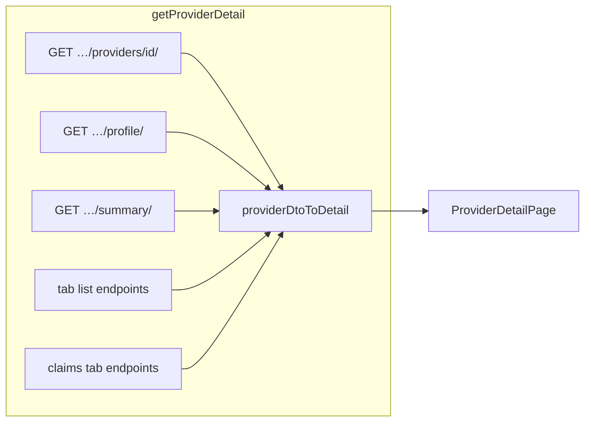

# Provider detail page — frontend gap analysis

**Date:** 2026-09-01  
**Scope:** `ProviderDetailPage.tsx` and its data path only (not Vendor entity pages, not list page).  
**Policy:** Integrate against **remote** `vendor-management-core` APIs. **No local backend changes.**

**Related:** [PROVIDER_API_GAP_ANALYSIS.md](./PROVIDER_API_GAP_ANALYSIS.md) (broader provider feature wiring)

---

## Data flow

**Load path**

1. [`getProviderDetail()`](./feature/api/providersApi.ts) — parallel fetch of core, profile, summary, tab lists, claims analytics.
2. [`providerDtoToDetail()`](./live-providers.ts) — maps DTOs → `ProviderDetail` view model.
3. [`ProviderDetailPage.tsx`](./pages/ProviderDetailPage.tsx) — renders Overview, Claims, Credentialing, etc.

---

## Already wired (no backend work needed)

These use endpoints already on remote `vendor-management-core` `main`.

| Area                                                      | Remote endpoint                        | Frontend                                                    |
| --------------------------------------------------------- | -------------------------------------- | ----------------------------------------------------------- |
| Core provider + embedded profile                          | `GET /api/v1/providers/<id>/`          | `getProviderDto`                                            |
| Full profile                                              | `GET …/profile/`                       | `vendorCoreApi.getProviderProfile`                          |
| KPI summary + trend %                                     | `GET …/summary/`                       | `vendorCoreApi.getProviderSummary` → `claimsTrendPct`, etc. |
| Monthly volume chart                                      | `GET …/claims/monthly-volume/list/`    | `listProviderMonthlyVolume`                                 |
| Rejection reasons                                         | `GET …/claims/rejection-reasons/list/` | `listProviderRejectionReasons`                              |
| Recent claims / encounters                                | `GET …/claims/recent/list/?kind=…`     | `listProviderRecentActivity`                                |
| Locations, identifiers, networks, credentials, exceptions | `GET …/<resource>/list/`               | Tab list fetches in `getProviderDetail`                     |
| Vendor roster feeds                                       | `GET …/vendor-sources/list/`           | `mapVendorSources()` (`data_sent`, `frequency`, `status`)   |
| Status change                                             | `POST …/status/`                       | `handleSetStatus` on detail                                 |
| Soft archive                                              | `DELETE …/delete/`                     | `handleArchiveProvider` on detail                           |

---

## Frontend gaps (fix in `vendor-management` only)

| Gap                                                    | Root cause                                                                                                                                                                                   | Suggested fix                                                                                                                                                                               |
| ------------------------------------------------------ | -------------------------------------------------------------------------------------------------------------------------------------------------------------------------------------------- | ------------------------------------------------------------------------------------------------------------------------------------------------------------------------------------------- |
| **Demographics show `—`**                              | `providerDtoToDetail()` hardcodes `preferredName: null`, `preferredLanguage/race/ethnicity: "—"` even though profile API returns `preferred_name`, `preferred_language`, `race`, `ethnicity` | Add fields to `ProviderProfileCompactDto` / `ProviderProfileDto` in [`types.ts`](../../../../lib/vendor-core/types.ts); map from `profile` in [`live-providers.ts`](./live-providers.ts)    |
| **Tab sub-resources read-only**                        | Client CRUD exists; detail tabs have no create/edit/delete UI                                                                                                                                | Wire [`vendorCoreApi`](../../../../lib/vendor-core/api.ts) `create/update/delete*` methods; add modals or drawers per tab (locations, networks, credentials, exceptions, identifier delete) |
| **Hard delete**                                        | `hardDeleteProvider` in client + [`providersApi`](./feature/api/providersApi.ts); no detail action                                                                                           | Optional admin-only destructive action with confirm dialog                                                                                                                                  |
| **Restore on detail**                                  | `restoreProvider` only on [`ProvidersPage`](./pages/ProvidersPage.tsx)                                                                                                                       | Show restore CTA in detail header when `is_deleted`                                                                                                                                         |
| **Roster drill-down**                                  | `listProviderRosterProviders` client exists                                                                                                                                                  | Drawer from roster chip → paginated providers in roster                                                                                                                                     |
| **Claims empty vs failed**                             | `getProviderDetail()` uses `.catch(() => [])` on claims fetches                                                                                                                              | Partial-failure banner or per-section error state when API fails vs truly empty                                                                                                             |
| **List `claims12m` / `paid12m`** (out of detail scope) | List serializer has no KPI embed on remote backend; `providersToSummaries()` falls back to `0`                                                                                               | Accept zeros on list, or wait for remote backend list embed — do **not** add local backend changes                                                                                          |

---

## Explicit non-goals

- **No local backend changes** — do not re-add list KPI fields to `ProviderListOutputSerializer` locally.
- Detail KPIs/charts do **not** depend on list embed; they use `…/summary/` and claims endpoints.
- Vendor entity detail (`VendorDetailLivePage`) is a separate feature.

---

## Files to touch when implementing gaps

| File                                                             | Change                                         |
| ---------------------------------------------------------------- | ---------------------------------------------- |
| [`live-providers.ts`](./live-providers.ts)                       | Map demographics from profile                  |
| [`types.ts`](../../../../lib/vendor-core/types.ts)               | Profile demographic fields on DTOs             |
| [`ProviderDetailPage.tsx`](./pages/ProviderDetailPage.tsx)       | Tab CRUD UI, restore/hard-delete, error states |
| [`useProvidersQuery.ts`](./feature/queries/useProvidersQuery.ts) | Mutations for tab CRUD if not already present  |
| [`providersApi.ts`](./feature/api/providersApi.ts)               | Thin wrappers for new mutations if needed      |

---

## Verification checklist (detail page, live API)

- [ ] Overview: KPI cards show non-zero values when backend has claim data (`…/summary/`).
- [ ] Overview / Claims: monthly volume and rejection charts render from claims endpoints.
- [ ] Claims tab: recent claims and encounters tables populate.
- [ ] Vendors tab: `data_sent`, `frequency`, feed `status` display (not all defaults).
- [ ] Demographics row: preferred name, language, race, ethnicity (after mapper fix).
- [ ] Archive + status actions succeed without page errors.
