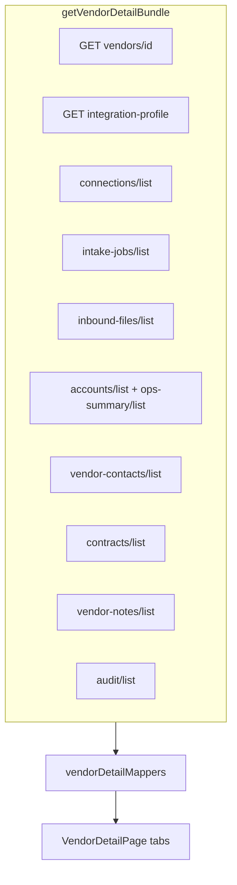

# Vendor detail page — integration gap analysis

**Date:** 2026-09-01  
**Scope:** `VendorDetailPage.tsx` at `/admin/vendors/[id]` — vendor entity (not provider detail).  
**Policy:** Integrate against **remote** `vendor-management-core`. **No local backend changes.**

**Feature layer:** [`getVendorDetailBundle()`](./feature/api/vendorDetailApi.ts) + [`VendorDetailBundleModel`](./feature/types/vendorDetailModel.ts) mirror every UI section below.

---

## Why tabs look empty (short answer)

| What you see                             | Most likely cause                                                                                                                                                                                                       |
| ---------------------------------------- | ----------------------------------------------------------------------------------------------------------------------------------------------------------------------------------------------------------------------- |
| **Overview / Operations** — no file runs | Remote DB has **no `InboundFile` rows** for this `vendor_id` (jobs can exist without files). Program-filter bug was fixed; empty now = real zero data or API error (check red banner).                                  |
| **Accounts (1)** tab but **0 rows**      | Tab count used `integration-profile.accounts_count` (DB aggregate) while `accounts/list` returned **[]** — count mismatch fixed to use list length only. If still 0, profile count is stale vs list filter/permissions. |
| **Contracts (0)** + all sub-tabs empty   | **No contracts** seeded for vendor on remote API. Sub-tabs (Details, Effective Dates, Rate/SLA, Documents) all read the same `contracts/list?vendor_id=` — zero contracts → zero everywhere.                            |
| **Notes (0)**                            | `vendor-notes/list` returns empty — API wired; no notes in DB. UI fields like category/priority/attachments are **frontend-only** (not on `VendorNote` model).                                                          |
| **Audit Trail (0)**                      | Fixed: frontend now uses `audit/list?vendor_id=` (backend expands to child resources). Remaining empty = no audit rows in DB.                                                                                           |
| **Header contacts `—`**                  | No `VendorContact` rows and no `primary_contact` embed on vendor DTO.                                                                                                                                                   |
| **Configuration full**                   | Uses **synthesized** profile (`buildVendorIntegrationProfile`) + first connection — looks populated even with sparse API data.                                                                                          |

---

## Data flow



---

## Header metadata

| UI card          | View model field                | API                                         | Gap                                              |
| ---------------- | ------------------------------- | ------------------------------------------- | ------------------------------------------------ |
| Vendor Type      | `header.integration.vendorType` | categories on vendor / integration profile  | Categories embed partial on vendor DTO           |
| Primary Contact  | `header.primaryContact`         | `vendor-contacts/list`                      | **Contacts tab** — header shows phone/email only |
| Phone / Email    | contact fields                  | same                                        | **Wired** via contact CRUD                       |
| SFTP Server      | `header.integration.sftpHost`   | `connections/list` → `config.host`          | **Synthesized** when no connection               |
| Time Zone        | `header.integration.timezone`   | `integration-profile.timezone`              | OK (defaults UTC)                                |
| Created On / By  | vendor `createdAt` / —          | `GET vendors/{id}/`                         | **created_by** not on serializer                 |
| Last Updated     | vendor `updatedAt`              | vendor detail                               | OK                                               |
| Health Indicator | `header.integration.health`     | profile.health + connection health fallback | OK                                               |

---

## Overview tab

| UI section                     | View model                    | API                                                      | Gap                                                                            |
| ------------------------------ | ----------------------------- | -------------------------------------------------------- | ------------------------------------------------------------------------------ |
| **Recent File Activity** table | `overview.recentRuns`         | `inbound-files/list?vendor_id=`                          | **Wired** — `record_count` + `duration_seconds` from latest backend serializer |
| File Type donut                | `overview.fileTypeSummary`    | derived from runs                                        | Populated when inbound files exist                                             |
| Processing Trend chart         | `overview.trend`              | derived from runs                                        | Populated when inbound files exist                                             |
| Records / Duration columns     | `FileRun.records`, `duration` | `InboundFileSerializer.record_count`, `duration_seconds` | **Wired** in `inboundFilesToRuns()`                                            |

**Seed Overview data:** `pnpm seed:vendor-detail` (5 inbound uploads, 2 contacts, 3 notes, 2 contracts, 2 docs, account) or remote `manage.py seed_demo_vendor_detail`.

---

## Operations tab

| UI section                              | View model                      | API                                   | Gap                                                    |
| --------------------------------------- | ------------------------------- | ------------------------------------- | ------------------------------------------------------ |
| Summary: Total/Success/Warn/Failed runs | `operations.summary`            | inbound files → runs                  | Same as Overview                                       |
| Active Jobs                             | `operations.summary.activeJobs` | `intake-jobs/list?vendor_id=`         | **Can be > 0 while runs = 0** (jobs without file runs) |
| Open Alerts                             | `operations.summary.openAlerts` | derived from failed connections/files | FE-only; no alerts API                                 |
| **File History** sub-tab                | `operations.runs`               | inbound-files + events                | Empty without inbound files                            |
| **Jobs** sub-tab                        | `operations.configJobs`         | intake jobs                           | Wired — shows 3 in screenshot                          |
| **Processing Logs**                     | run `logs[]`                    | `inbound-files/{id}/events/`          | Per-file N+1 fetch; empty without files                |
| **Alerts** sub-tab                      | `operations.alerts`             | derived                               | FE-only                                                |

---

## Configuration tab

| UI section                        | API                              | Gap                                                                |
| --------------------------------- | -------------------------------- | ------------------------------------------------------------------ |
| Integration profile fields        | `GET/PATCH integration-profile/` | **Wired** — Configuration tab edit profile dialog + PATCH mutation |
| SFTP connection block             | `connections/list` + synthesis   | `VendorSftpConnection` model has **no CRUD API**                   |
| Config jobs table                 | `intake-jobs/list`               | Uses intake app, not `VendorConfigJob`                             |
| Create / test / update connection | connections APIs                 | Wired                                                              |

---

## Accounts tab

| UI section                                           | View model          | API                                             | Gap                                                                                                                  |
| ---------------------------------------------------- | ------------------- | ----------------------------------------------- | -------------------------------------------------------------------------------------------------------------------- |
| Summary cards (total/active/warnings/errors)         | `accounts.summary`  | `accounts/list` + mapper                        | **Was showing fake "Files Today: 24"** — fixed to 0 when no accounts                                                 |
| Account table rows                                   | `accounts.rows`     | `accounts/list?vendor_id=` + `ops-summary/list` | **Seed** `pnpm seed:vendor-detail` creates 4 accounts; ops-summary array response fixed in `listAccountOpsSummaries` |
| Eligibility / Medical / Pharmacy / Accumulator icons | row `*_feed_status` | account DTO + ops summary                       | Partial — depends on ops-summary join                                                                                |
| Health score ring                                    | `healthScore`       | `health_score` + ops summary                    | Partial                                                                                                              |
| Trend chart (detail drawer)                          | **placeholder**     | —                                               | **No account health trend API**                                                                                      |
| Add / edit / delete account                          | mutations           | accounts CRUD                                   | Wired                                                                                                                |

---

## Contracts tab (main + 6 sidebar sections)

All sections consume **`contracts/list?vendor_id=`** via [`VendorContractsTab`](./components/VendorContractsTab.tsx).

| Sidebar section         | Component                      | Data source                                                           | Backend gap                                                                                                                      |
| ----------------------- | ------------------------------ | --------------------------------------------------------------------- | -------------------------------------------------------------------------------------------------------------------------------- |
| **Overview**            | `ContractsPage` embedded       | contract list                                                         | **Zero contracts in DB** → all empty                                                                                             |
| **Contract Details**    | `ContractsDetailsHubPage`      | list → detail fields                                                  | List serializer only; detail = same fields                                                                                       |
| **Effective Dates**     | `ContractsEffectiveDatesPage`  | `terms[]` derived from `effective_date` / `expiration_date`           | **No `terms[]` on API** — FE derives primary term in [`contractDtoToModel`](../contracts/feature/mappers/contractCoreMappers.ts) |
| **Rate / Fee Schedule** | `ContractsRateFeeSchedulePage` | `rate_schedule[]` on detail; list derives from `total_contract_value` | **Detail wired** via `ContractDetailOutputSerializer`; list still derives lump-sum row                                           |
| **SLA Terms**           | `ContractsSlaTermsPage`        | `sla_metrics[]` on detail                                             | **Detail wired** from contract obligations; list falls back to payment terms                                                     |
| **Documents**           | `ContractsDocumentsPage`       | `GET /documents/list/?vendor_id=` + detail `documents[]` embed        | **Wired**; upload via Documents tab / contract detail                                                                            |

`ContractDetailOutputSerializer` = list serializer (no embeds). Rich mock UI fields (rate lines, document uploads, SLA metrics) need backend embeds or separate procurement endpoints.

---

## Notes tab

| UI section                                             | View model              | API                           | Gap                                                                                                               |
| ------------------------------------------------------ | ----------------------- | ----------------------------- | ----------------------------------------------------------------------------------------------------------------- |
| Summary cards (total/open/action/attachments/archived) | `notes.count` + filters | `vendor-notes/list`           | **category, priority, status, attachments** not on `VendorNote` model — mapper defaults (`General`, `Open`, etc.) |
| Notes table                                            | `notes.notes`           | vendor-notes CRUD             | Wired; empty = no rows in DB                                                                                      |
| Detail panel / activity                                | `VendorNoteUi.activity` | synthesized from `created_at` | Partial                                                                                                           |

---

## Audit Trail tab

| UI section                   | View model                                         | API                     | Gap                                                      |
| ---------------------------- | -------------------------------------------------- | ----------------------- | -------------------------------------------------------- |
| Summary cards (5 categories) | `audit.activityCount` + `summarizeAuditActivities` | `audit/list?vendor_id=` | **Fixed** — uses vendor-scoped query; errors show banner |
| Activity table               | `AuditTrailView` local fetch                       | same                    | **Fixed** — `vendor_id` param + error banner             |

---

## Frontend fixes applied

| Issue                              | Fix                                                                             |
| ---------------------------------- | ------------------------------------------------------------------------------- |
| Program filter hid all runs        | Removed MDH/DHCF filter on vendor detail; infer program from file metadata      |
| Tab **Accounts (1)** with 0 rows   | Tab count uses `accounts.length` only                                           |
| Fake **Files Processed Today: 24** | `0` when no accounts                                                            |
| Contract sub-tabs empty structure  | `contractDtoToModel` derives `terms[]` + basic `slaMetrics` from list DTO       |
| Scattered queries                  | **`VendorDetailPage` uses `useVendorDetailBundleQuery`** (single parallel load) |
| Vendor contacts CRUD               | **Contacts tab** — add/edit/delete via `VendorContactsTab`                      |
| Integration profile PATCH          | `useUpdateVendorIntegrationProfileMutation` + Configuration tab edit dialog     |

---

## Feature layer files

| File                                                                                 | Role                         |
| ------------------------------------------------------------------------------------ | ---------------------------- |
| [`feature/dto/vendorDetailDto.ts`](./feature/dto/vendorDetailDto.ts)                 | Raw parallel-load DTO bundle |
| [`feature/types/vendorDetailModel.ts`](./feature/types/vendorDetailModel.ts)         | Per-tab view models          |
| [`feature/mappers/vendorDetailMappers.ts`](./feature/mappers/vendorDetailMappers.ts) | DTO → view model             |
| [`feature/api/vendorDetailApi.ts`](./feature/api/vendorDetailApi.ts)                 | `getVendorDetailBundle()`    |
| [`feature/queries/useVendorsQuery.ts`](./feature/queries/useVendorsQuery.ts)         | `useVendorDetailBundleQuery` |

---

## Remote backend follow-ups (not local)

1. Seed or create **inbound files** + **contracts** + **vendor contacts** + **notes** for demo vendors.
2. Align **audit** `resource_id` with vendor UUID for vendor-scoped trail.
3. Contract **detail embeds**: `terms`, `rate_schedule`, `sla_metrics`, `documents`.
4. ~~Wire **`GET /documents/list/?vendor_id=`** in frontend for Documents sub-tab.~~ Done.
5. Seed demo data: `pnpm seed:vendor-detail` (mirrors `seed_demo_vendor_detail` — contacts, notes, contracts, documents, account, 5 inbound files).

```bash
VENDOR_CORE_USER=… VENDOR_CORE_PASSWORD=… pnpm seed:vendor-detail
# optional: VENDOR_CODE=ust or VENDOR_ID=<uuid>
# if inbound upload skipped: run pnpm seed:vendor-core first for a connection
# on backend host: python manage.py seed_demo_vendor_detail --vendor-code=ust
```

6. Account list vs integration-profile **accounts_count** mismatch — verify list filter / visibility.
7. Vendor KPI summary endpoint (optional) to replace client-side cross-app aggregation.

---

## Verification checklist (live API)

- [ ] Error banners appear when sub-queries fail (not silent empty).
- [ ] Overview/Operations show runs when `inbound-files/list?vendor_id=` returns rows.
- [ ] Accounts tab count matches table row count.
- [ ] Contracts sub-tabs show derived terms when contracts exist.
- [ ] Notes CRUD works; empty state vs error state distinguishable.
- [ ] Audit populates when `audit/list?vendor_id=<vendor_id>` returns rows.
- [ ] Header contacts add/edit/delete refresh bundle after mutation.
- [ ] Configuration tab integration profile PATCH persists timezone/transmission/encryption.
